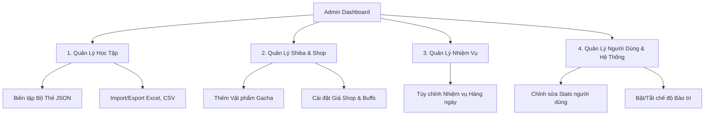

# Kế Hoạch Thiết Kế Trang Quản Trị (Admin Dashboard) - Nihongo Flashcard

Dự án hiện tại đã tích hợp rất nhiều chức năng thú vị (Flashcard, RPG Shiba Room, Tiệm vật phẩm, Gacha, Mini-games, Visual Novel). Để việc phát triển và vận hành trở nên dễ dàng mà không cần sửa code liên tục, việc xây dựng một trang Admin trực quan là cực kỳ cần thiết.

Dưới đây là phân tích chi tiết về thiết kế UI, các phân hệ quản lý và giải pháp kỹ thuật cho trang Admin.

---

## 1. Phân Tích Các Phân Hệ Quản Lý (Key Management Modules)

Dự án hiện tại bắt đầu có nhiều chức năng, do đó trang Admin nên được phân tách thành **4 phân hệ quản lý rõ ràng**:



### Module 1: Quản Lý Học Tập (Flashcards & Decks)
Đây là phần cốt lõi, thao tác trực tiếp với các tệp tin trong `public/data/`.
*   **Chức năng:**
    *   **Danh sách Bộ thẻ (Decks):** Xem danh sách toàn bộ các bộ từ vựng hiện có (N5, N4, Kanji...).
    *   **Trình chỉnh sửa thẻ (Card Editor):** 
        *   Thêm mới/Sửa/Xóa từ vựng (Từ Kanji, Hiragana, Nghĩa tiếng Việt, Ví dụ minh họa, Link file âm thanh phát âm `.mp3`).
        *   Tích hợp phát thử file âm thanh trực tiếp trên giao diện để kiểm tra trước khi lưu.
    *   **Bộ lọc thông minh:** Lọc theo cấp độ (N5-N1), theo loại thẻ (Từ vựng, Kanji, Ngữ pháp).
    *   **Công cụ Import/Export nhanh:** 
        *   Import từ Excel/CSV/Google Sheets (dạng bảng) -> tự động chuyển đổi thành cấu trúc JSON chuẩn.
        *   Tải xuống (Export) / Tạo bản sao lưu (Backup) các file JSON phòng hờ khi có sự cố.

### Module 2: Quản Lý Shiba Room, Gacha & Shop
Quản lý các danh mục cấu hình hệ thống trong `gachaPool.ts` và `shopItems.ts`.
*   **Chức năng:**
    *   **Quản lý Gacha Pool:** Thêm/Sửa/Xóa các vật phẩm quay thưởng (Trang phục, Đồ nội thất trang trí phòng, Bùa chú, Gói giọng nói, Sticker).
    *   **Thiết lập chỉ số RPG:** Chỉnh sửa các chỉ số cộng thêm của vật phẩm (HP Bonus, ATK, DEF, Crit, vị trí trang bị `rpgSlot`).
    *   **Cài đặt Tỷ lệ rơi (Rate):** Điều chỉnh tỷ lệ gacha theo các cấp bậc độ hiếm (Common, Rare, Epic, Legendary, Mythic, Divine).
    *   **Quản lý Cửa Hàng (Shiba Shop):** Điều chỉnh giá bán (Lông Vàng), mô tả, cốt truyện (lore) của mảnh ghép, vật phẩm độc quyền, và bùa chú.

### Module 3: Quản Lý Nhiệm Vụ Hàng Ngày (Daily Quests)
Quản lý các thử thách cày Xương/Lông Vàng cho người học.
*   **Chức năng:**
    *   Thêm/Sửa/Xóa nội dung nhiệm vụ (ví dụ: "Lập đúng 20 thẻ", "Thắng Boss gõ phím 1 lần").
    *   Cấu hình phần thưởng (Số lượng Xương, số lượng Lông Vàng nhận được).
    *   Kích hoạt/Tạm ngưng nhiệm vụ theo chu kỳ sự kiện (Event).

### Module 4: Quản Lý Người Dùng & Hệ Thống
*   **Chức năng:**
    *   Tra cứu thông tin học viên (Email, Tên, Ngày tham gia).
    *   **Công cụ thử nghiệm (Testing/Cheat Tool):** Cho phép admin cộng/trừ Xương, Lông Vàng, mở khóa nhanh toàn bộ vật phẩm cho một tài khoản cụ thể để phục vụ công tác kiểm thử (test) game mà không cần tự cày cuốc.
    *   Quản lý thông báo chung của hệ thống (System Announcement banner).

---

## 2. Thiết Kế Giao Diện UI (Wireframe & Layout)

Để giao diện trang quản trị trực quan và dễ sử dụng, ta thiết kế theo bố cục chuẩn **Sidebar (Thanh điều hướng bên trái) + Main Content (Nội dung bên phải)**.

Giao diện sẽ mang phong cách **Sạch sẽ, Chuyên nghiệp (Dashboard style)** nhưng vẫn giữ các đường bo góc tròn trịa, phối tông màu nâu sữa gỗ trầm nhẹ để đồng bộ với phong cách dễ thương (Shiba) của trang chính.

### Bố cục giao diện tổng quát:

```
+-----------------------------------------------------------------------------------+
|  [SHIBA ADMIN]   | Tiêu đề Phân hệ (Ví dụ: QUẢN LÝ BỘ THẺ)         [Admin: admin@...]  |
+------------------+----------------------------------------------------------------+
| (Icon) Bộ thẻ    |  [Tìm kiếm...]    [+ Thêm Từ Vựng]     [Import Excel]  [Export] |
| (Icon) Gacha     |  +----------------------------------------------------------+  |
| (Icon) Shop      |  | Từ (Kanji) | Cách đọc  | Nghĩa tiếng Việt | Hành động    |  |
| (Icon) Nhiệm vụ  |  +------------+-----------+------------------+--------------+  |
| (Icon) User      |  | 漢字       | かんじ    | Chữ Hán          | [Sửa] [Xóa]  |  |
|                  |  | 日本語     | にほんご  | Tiếng Nhật       | [Sửa] [Xóa]  |  |
|                  |  +------------+-----------+------------------+--------------+  |
|                  |  [Trang trước]      Trang 1 / 10      [Trang sau]               |
+------------------+----------------------------------------------------------------+
```

### Các thành phần UI cao cấp đề xuất:
1.  **Form chỉnh sửa thẻ dạng Drawer (Trượt từ cạnh phải vào):**
    *   Khi bấm vào nút "Sửa" hoặc "Thêm mới", một bảng Drawer sẽ trượt mượt mà từ cạnh phải màn hình ra (sử dụng Framer Motion). Điều này giúp admin vừa đối chiếu danh sách tổng thể vừa chỉnh sửa chi tiết mà không bị mất ngữ cảnh.
    *   Có thanh tiến trình upload ảnh/âm thanh và preview trực quan.
2.  **Bộ lọc danh mục dạng thẻ (Filter Tags):**
    *   Hỗ trợ chọn nhanh các thẻ phân loại bằng các viên nhãn (pill tags) màu sắc, dễ dàng click lọc theo level N5/N4/N3 chỉ với 1 click.
3.  **Bảng quản lý chỉ số Gacha trực quan (Visual Slider):**
    *   Khi điều chỉnh tỷ lệ rớt (drop rate) của Gacha, admin có thể kéo các thanh Slider hoặc xem biểu đồ hình tròn (Pie Chart) cập nhật thời gian thực để đảm bảo tổng tỷ lệ luôn là 100%.

---

## 3. Giải Pháp Kỹ Thuật & Luồng Dữ Liệu (Technical Flow)

Để giải quyết bài toán: **Lưu file JSON tĩnh nhưng vẫn muốn sửa qua giao diện Web**, ta sẽ xây dựng luồng xử lý riêng biệt cho môi trường **Development (Local)** và **Production (Live)**.

```
MÔI TRƯỜNG PHÁT TRIỂN (LOCAL DEV)
[Trình duyệt Admin] ──(Gọi API POST)──> [Next.js Local Server] ──(fs.writeFile)──> [public/data/*.json] (Cập nhật trực tiếp code)
                                                                                              │
                                                                                     (Git Commit & Deploy)
                                                                                              │
                                                                                              ▼
MÔI TRƯỜNG LIVE (PRODUCTION)
[Trình duyệt User] <───────────────── Tải cực nhanh từ CDN ───────────────────────── [Vercel Hosting]
```

### A. Cơ chế đọc/ghi file tĩnh ở môi trường Local (Development Mode Only)
*   **API ghi đè:** Chúng ta viết các API route như `/api/admin/save-json`. API này sẽ sử dụng module `fs` (File System) của Node.js để ghi thẳng vào thư mục `public/data/`.
*   **Bảo mật:** API này sẽ kiểm tra điều kiện nghiêm ngặt:
    ```typescript
    if (process.env.NODE_ENV !== "development") {
      return NextResponse.json({ error: "Chức năng ghi file chỉ hỗ trợ ở môi trường Dev" }, { status: 403 });
    }
    ```
    Điều này cực kỳ an toàn, ngăn chặn việc người lạ xâm nhập và ghi đè file trên server production (vì các hosting như Vercel là Read-only file system, không cho ghi file trực tiếp).
*   **Quy trình làm việc:** Bạn chạy app ở máy mình (`npm run dev`), vào trang admin sửa đổi dữ liệu -> file JSON được cập nhật tự động trong folder dự án của bạn -> bạn check thay đổi bằng `git diff` -> commit và push lên github để deploy tự động lên web thật.

### B. Cơ chế quản lý Dữ liệu Động (Firebase Firestore)
*   Đối với thông tin người dùng, bảng xếp hạng, tiến độ học, hoặc nhiệm vụ hàng ngày: Trang admin sẽ sử dụng trực tiếp SDK của Firebase để cập nhật thẳng lên Firestore theo thời gian thực (Realtime).
*   **Bảo mật trên Production:** 
    *   Phân quyền tài khoản: Thêm một trường `role: "admin"` vào document của user trong collection `users` trên Firestore.
    *   **Firebase Security Rules:** Thiết lập quy tắc để chỉ những user có `request.auth.token.role == 'admin'` mới được quyền đọc/ghi vào các dữ liệu nhạy cảm này.
